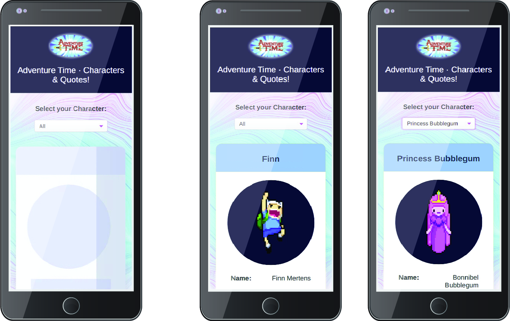
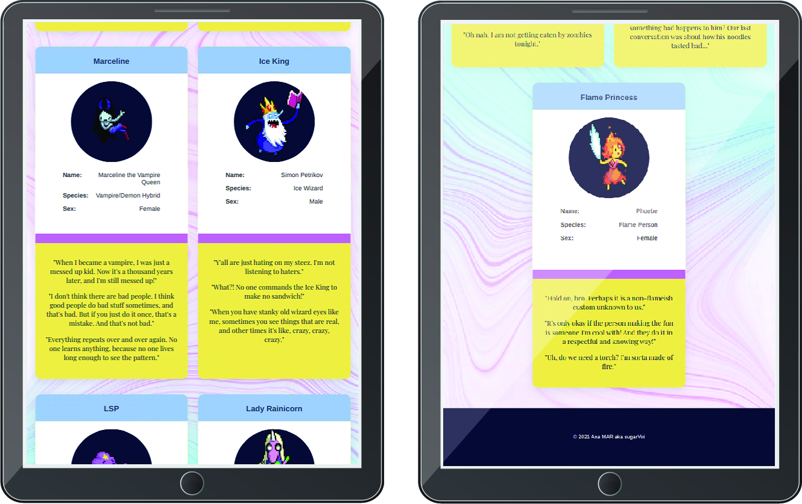

<span style="display:block;text-align:center;"></span>

# Adventure Time Cards 	:star2:
>Select Characters and get inspired by their quotes!  Made with Vue3 and Vitejs as Frontend tools
>


## Objectives

:zap: Consume external API with Axios  

:zap: Include skeleton loader  

:zap: Filter by character  

:zap: Responsive  

:zap: Apply CSS Variables  

:zap: Timeout on page reload

***




***

## Installation

Clone the repo and run it with Npm or Yarn

```javascript
npm run dev
```

```javascript
yarn run dev
```
## Credits

API from Young Ju Park sally/adventure-time-api  
[https://adventure-time-api.herokuapp.com](https://adventure-time-api.herokuapp.com/)